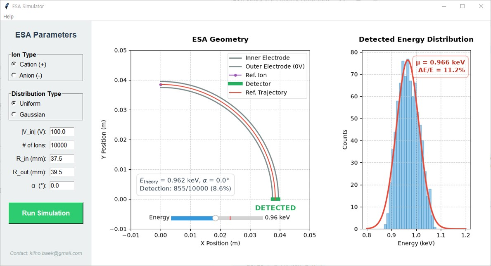

# ElectroStatic Analyzer (ESA) Simulator

> Developed as a personal side project.  
> **Current Version**: `v1.1.0-alpha`

This program is a real-time Monte Carlo ray-tracing ESA simulator designed for space mission planning and instrument design.

It analytically calculates the electric field inside a Top-Hat structure and visually demonstrates ion dynamics based on user-defined geometric parameters, voltages, and energies via an interactive GUI to determine the observable particle energy distribution and energy resolution ($\Delta E/E$).

## Key Features



The simulator's graphical interface is divided into three main panels:

* **Left Panel (Parameters Setup)**: Provides an interactive control panel to configure ESA geometry ($R_\mathrm{in}$, $R_\mathrm{out}$), deflector voltage ($|V_\mathrm{in}|$), incident angle ($\alpha$), and Monte Carlo beam properties (Number of Ions, Ion Type, Distribution Type). The simulation is manually triggered via the **[Run Simulation]** button located here.

* **Middle Panel (Geometry Plot)**: Displays the cross-section of the ESA and the trajectory of a single reference ion entering exactly at the center of the aperture.

* **Right Panel (Detection Histogram)**: Displays the energy distribution of successfully detected ions from a randomly distributed incident beam. It automatically performs a **Gaussian fit** on the detected particles to calculate and display the instrument's **Energy Resolution** ($\Delta E/E$).

## Input Parameters

* $|V_\mathrm{in}|$ (V): The voltage applied to the inner electrode (Deflector Voltage).

* \# of Ions: The total number of incident ions generated for the Monte Carlo simulation.

* $R_{in}$ & $R_{out}$ (mm): The radii of the inner and outer hemispherical electrodes.

* $\alpha$ (deg): The incident angle of the ion. (Note: This parameter is exclusively used to display the trajectory of the reference ion in the middle geometry plot. It does not dictate the center angle of the random beam distribution).

## Incident Ions Distribution

The simulator utilizes a random distribution of incident ions to perform the Monte Carlo ray-tracing. The parameters for the randomly generated ions are constrained as follows:

* **Distribution Types**: You can select between **Uniform** (evenly spread across the allowed ranges) and **Gaussian** (normally distributed around the center values).

* **Incident Position**: Randomly distributed within the physical limits of the aperture gap (between the inner radius $R_\mathrm{in}$ and the outer radius $R_\mathrm{out}$).

* **Incident Angle**: Randomly distributed within a spread of $\pm 5^\circ$ centered around 0 degrees.

* **Ion Energy**: Randomly distributed within a $\pm 20\%$ bandwidth around the theoretical center energy. This theoretical energy is analytically derived from the input Deflector Voltage ($|V_\mathrm{in}|$).

## Important Usage Notes

* **Manual Execution Required**: To prevent accidental and heavy computational loads, the simulation **does NOT run automatically** when you modify text parameters or change radio buttons. You must explicitly click the **[Run Simulation]** button or press the **[Enter]** key to execute the calculation.

* **Ion Count Limits**: The `# of Ions` must be **at least 1,000** to run the simulation and perform a valid statistical fit.
  * **Warning**: Simulating **50,000 or more ions** can take a considerable amount of computational time.

* **Executable Startup Time**: If you are running the compiled ``.exe`` file from *Github Release*, please be patient; it may take ~10 seconds for the window to initially appear.

## Windows Executable (.exe) (No Python Required)

1. Download the ``esa_simulator.exe`` file from the **Releases** page
2. Double-click to run.  
(Note: Initial startup may take 5-10 seconds to extract and load essential math libraries.)

## Installation & Setup

* **No Extra GUI Installation**: Built using Python's native `tkinter` library. No additional GUI frameworks are required.
* **High-Speed Computation**: Powered by the `numba` package for fast numerical calculations.

### Prerequisites

* Python 3.8+
* Required packages: `numpy`, `scipy`, `matplotlib`, `numba`
* Optional package: `pyinstaller` (only for building the executable)

### Execute Python Script

```bash
# 1. Install Dependencies  
pip install numpy scipy matplotlib numba

# 2. Run the Source
python esa_simulator.py
```

### Build the Executable (.exe)

To modify the source code and build a standalone `.exe` for Windows, you will need `PyInstaller`. You can embed the developer information (credits) into the file properties using the provided `version.txt`.

```bash
# Install PyInstaller (if not already installed)
pip install pyinstaller

# Build the executable
pyinstaller --onefile --noconsole --windowed --version-file=version.txt esa_simulator.py
```

## Developer

Kilho Baek ([kilho.baek [at] gmail.com](mailto:kilho.baek@gmail.com))

## License

This project is distributed under the **MIT License**. See the LICENSE.txt file for details. You are free to use, modify, and distribute this software for your research and professional tasks.
